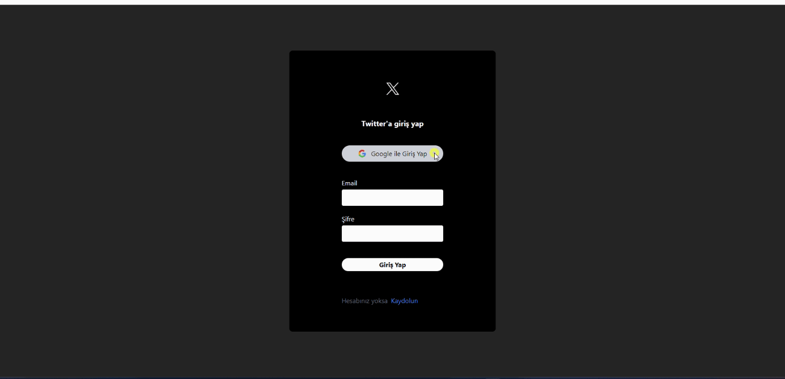

# Firebase X Clone

# Auth, Route Koruma, Eposta Gönderme, Storage, Edit, Delete, Like

# Kütüphaneler

- react-router-dom
- react-toastify
- react-icons
- moment
- uuid
- firebase
- tailwind

# Authentication (Kimlik Doğrulama)

- Bir kullanıcın kimliğini doğrulama süreciidir.
- Kullanıcı adı / şifre , parmak izi, google hesabı kimlik doğrulama için kullnılabilir.
- Giriş esnasında doğrulama yapmadığımız için profil fotoğrafı ve diğer kişisel bilgiler gelmemektedir.

# Authorization (Yetkilendirme)

- Bir kullanıcının sistemin kaynaklarına / işlevlerine / sayflarına erişim sürecidir.
- Yani kimlik doğrulama başarılı olduktan sonra kullanıcının ne kadar erişime sahip olduğunu belirleme sürecidir.

# Ekran görüntüsü

# 
